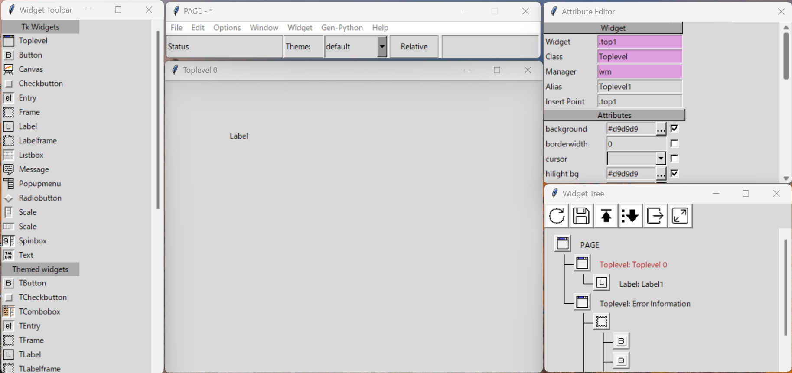
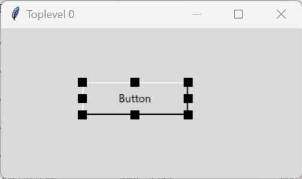
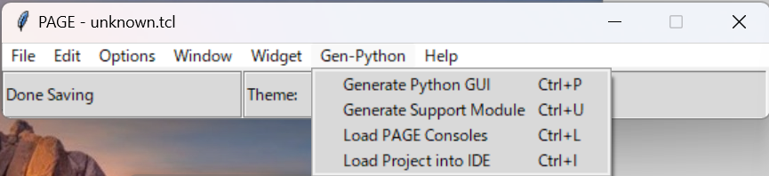
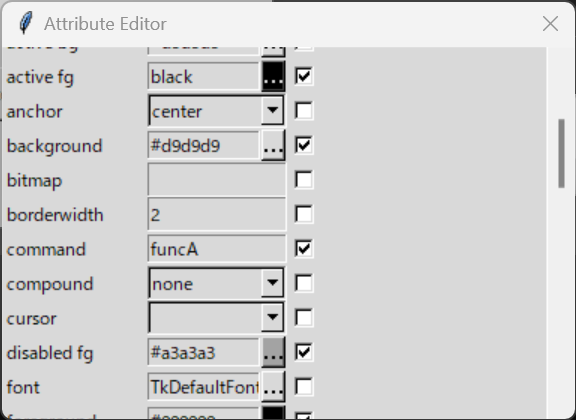
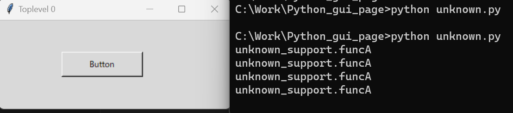
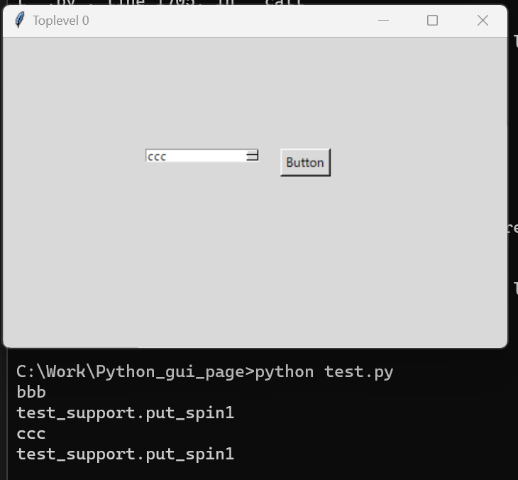

# PythonのGUI作成用の標準ライブラリ「Tkinter」のGUIエディタ「PAGE」

## 想像
ファイルのオープンや複数選択などが直感的にできる？
よく使うコードを覚える必要がなくなる？

## 操作手順
1. PAGE起動
1. VisualStudioと似たイメージでGUIを作成
1. Pyhtonコードで出力
1. 出力したスクリプトを実行

## 起動画面


## GUI作成
ボタンを一つ配置する。




「Generate Python GUI」と「Generate Support Module」を実行すると、以下の3ファイルが生成される。※unkownは名称未設定のため。
* unknown.py
* unknown.tcl
* unknown_support.py

## ボタンへの処理登録
以下のCommandに関数名を設定すると、

自動生成したunknown_support.pyに以下のような関数が用意される。
```
def funcA(*args):
    if _debug:
        print('unknown_support.funcA')
        for arg in args:
            print ('    another arg:', arg)
        sys.stdout.flush()
```

実際にボタンを押すと以下のようにログが出力されていた。


SpinBoxで選択した値を取得するのもほぼ自動生成で可能。


## 感想
自分が期待していたようなファイル操作系のコードの自動生成はなさそう。ただし、GUIを作るときに画面部分の作成だけなら簡単にできる。
作業ツールを作成するときの選択肢としてはありかもしれない。